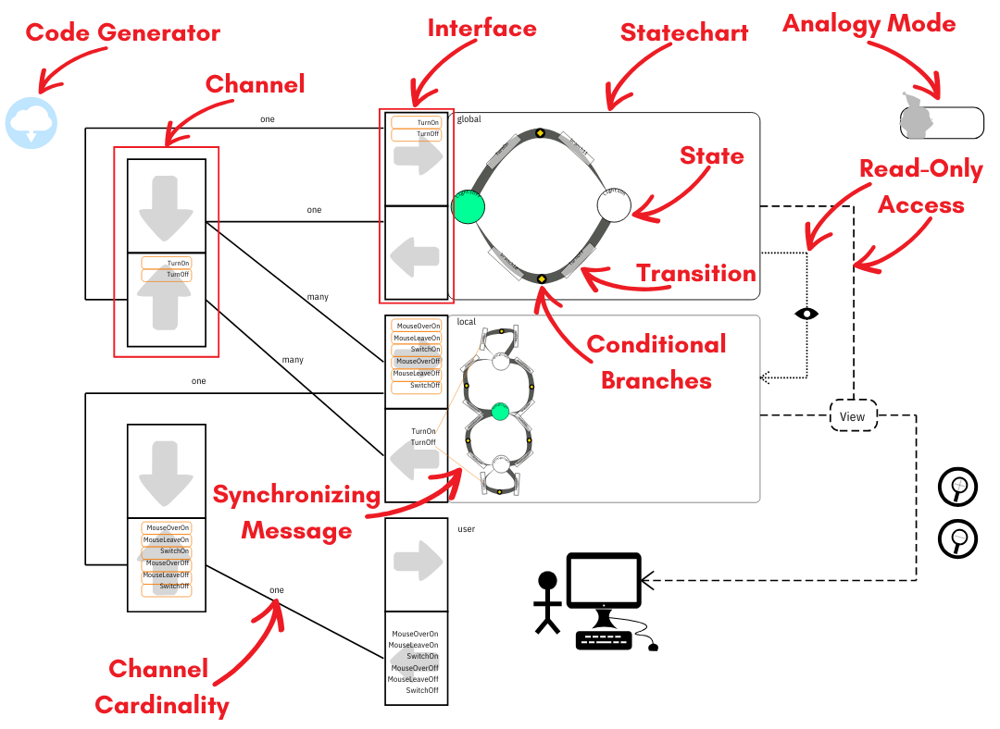
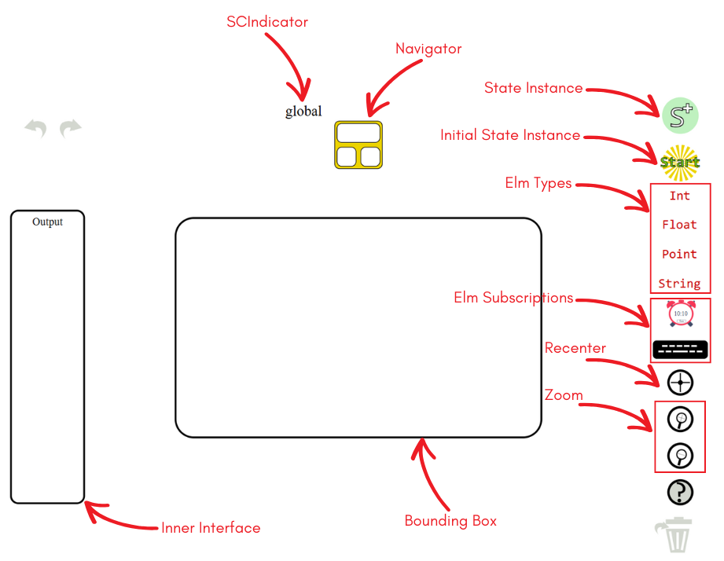

# Simplifying Teaching Concurrency with Communicating StateCharts (CSC)

In this guide, we provide an itroduction to our concurrency paradigm (CSC) and it's visual model-driven development tool (CSCDRaw).
This introduction is followed by two packages; [Try at Home package](#try-at-home) for getting started with our tool,
 and [Curriculum package](#curriculum) for teaching CSC to beginner programmers.

For any inquiries please contact [removed contact information for review].

## Table of Contents
- [Introduction](#introduction)
- [Try at Home](#try-at-home)
- [Curriculum](#curriculum)

<!-- ------------------------------------------------------------------------------------------------------------------------------------------------------- -->

## Introduction
We propose a new concurrency framework called *Communicating StateCharts (CSC)* with the potential to simplify the teaching concurrency to beginners. 
CSC is shaped by five main principles: software visualization, Model-Driven Development (MDD), pure functions,
separation of concerns, and abstraction. To satisfy these principles, CSC adapts features from existing concurrency models, namely
process calculi, the actor model, and Harel’s statecharts. This synthesis defines CSC’s atomic statecharts, which communicate through
message passing via channels. To make CSC accessible for beginners, a visual MDD tool called CSCDraw is designed and developed.
CSCDraw offers two modes:
1. **Overall Mode:** The overall mode illustrates
the channels connected to a statecharts’ interfaces, with the model
contents including states, transitions, and synchronizing messages. 
This view allows message specification and
code generation.

2. **SCEditing mode:** In this mode, the states and
transitions within a statechart can be edited.

For more details about CSC and CSCDraw please refer to (citation removed for review.)
<!-- the [master's thesis](http://hdl.handle.net/11375/31620) of Sheida Emdadi. -->

<!-- ------------------------------------------------------------------------------------------------------------------------------------------------------- -->
## Try at Home!

To try designing a multi-user application with our visual model-driven development tool, CSCDraw,
please consult this [Try at Home guide](src\Try-at-Home.md). 

<!-- ------------------------------------------------------------------------------------------------------------------------------------------------------- -->

## Curriculum

To teach students how to design and develop multi-user applications through CSC and CSCDraw,
we have prepared a [curriculum package](src\Curriculum.zip) that consists of teaching materials
and a comprehensive [guide](src\Curriculum.md) for teachers to how to use this package.

