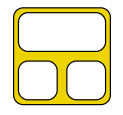
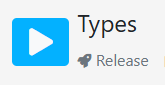
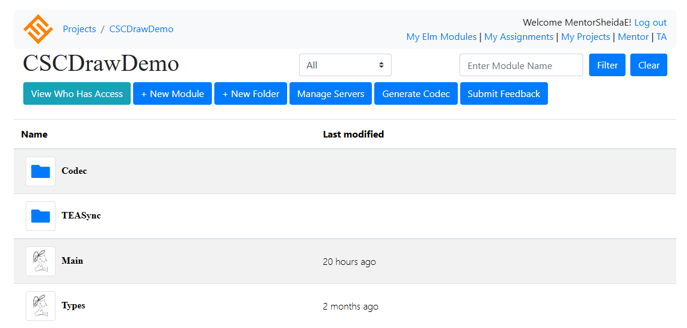

# Try at Home!

This guide provides a complete introduction on how to use CSCDraw.
No prior coding knowledge is required to get started.

## Table of Contents
- [Introduction](#introduction)
- [CSC Examples](#csc-examples)
    - [Lights Game](#lights-game)
    - [Party Game](#party-game)
- [Introduction to Our Online IDE](#introduction-to-our-online-ide)

## Introduction
1. download the [Try at Home Package](src\TryAtHome.rar) locally on your device. 
    - If you are facing any troubles with opening the package, please download these files manually: [CSCDraw](CSCDraw.html), [Party Game](#party-game), and [Lights Game](#lights-game).
2. click on CSCDraw.html on your device to open it with your browser.
    - It has been tested on Chrome (Version 138.0.7204.158).

Then, you can either
- try using our example pre-designed multi-player games by
    1. clicking on the upload button , and then 
    2. choosing one of the pre-designed CSCs from the [Try at Home Package](src\TryAtHome.rar), such as [Party Game](#party-game) or [Lights Game](#lights-game). 
        - To find a detailed decription of the examples, please consult the [CSC Examples](#csc-examples) section.
    3. generating code based on the designed models by clicking on the code generator button . 
    4. copying the generated code by `CTRL/CMD + A` and `CTRL/CMD + C`.
    5. Compile the generated code on our online IDE, [removed IDE for review.]
        - Section [Introduction to Our Online IDE](#introduction-to-our-online-ide) provides a detailed explanation of how to run your generated code on our online IDE.
            <!--[STaBL.rocks](https://stabl.rocks/). -->

, or

- design your own multi-user applications, by
    1. clicking on a statechart and navigating to the SCEditing mode.
    2. going back to the overall mode and designing the other statechart. 
        - Navigation from SCEditing mode to the Overall mode is possible by clicking on the navigator button .

    3. connecting messages to the channels in the Overall mode.
    4. generating code based on the designed models by clicking on the code generator . 
    5. copying the generated code by `CTRL/CMD + A` and `CTRL/CMD + C`.
    6. saving the designed model locally by clicking on the save button  (optional).
    7. Compile the generated code on our online IDE, [removed IDE for review.] 
        - Section [Introduction to Our Online IDE](#introduction-to-our-online-ide) provides a detailed explanation of how to run your generated code on our online IDE. 

    <!-- [STaBL.rocks](https://stabl.rocks/). -->

An example of the development process can be found in this [demonstration video](https://anonymous.4open.science/r/CSC-314B/Demo/AnonymousDemo.mp4). 

## CSC Examples

### Lights Game
This game is a very simple example of a CSC design to show how [synchronization](#introduction) happens in CSC.
This idea of this multi-player game is that when
a player hovers over a button it will light up only for them, 
and when they click on a button, it will switch ON/OFF
the lights for everybody connected to the server (global).

The [Lights Game](1-LightsGame\LightsGameCSC.json) can be found [game removed for review.]
<!-- [here](https://stabl.rocks/ShowTeasyncServerClient?teasyncServerId=b110fe0e-259c-46e8-8ec5-d365e5c03f7f). -->

### Party Game
The Party game is a multiplayer game that requires players to manage
their money to go to a party. In particular, the party will start only if at
least three players successfully arrive at the PartyRoom. If a player fails
to manage their money, then the party will be cancelled.

The [Party Game](3-PartyGame\PartyGame.json) can be found [game removed for review.]
<!-- [here](https://stabl.rocks/ShowTeasyncServerClient?teasyncServerId=0e4eba0f-79a2-414b-abac-c30f2adfb68e). -->

## Introduction to Our Online IDE

If you don't have an account on our IDE, please contact us. [contact information removed for review.]
<!-- [STaBL.rocks](https://stabl.rocks/), please contact either [Sheida](emdadibz@mcmaster.ca) or [Dr. Anand](anandc@mcmaster.ca). -->

After generating the code in CSCDraw, please log into your account on the IDE [link removed for review], and then follow these steps:
1. Choose `My Projects` tab.
2. Click on the `+New` button.
3. Create a project using `TEASync` template.
4. Open your created project.
5. Open the Types module.
6. Paste the generated code by `CTRL/CMD + V`.
7. Cut (`CTRL/CMD + X`) the code that belongs to the Main module. 
    - Look for this comment `--Put this code into the Main module.` in the generated code, then select and cut the code from this comment (by `CTRL/CMD + X`).
8. Before pasting the cut code, in the same module (Types) compile the code by clicking on the compile button .
9. Click on the `Release button in the Types module .
10. In your Project's page (where you can see the Main and Types modules), click on the `Generate Codec` button .
The Project's page looks like: [screentshot removed for review.]
    <!--  -->
    - If the encoders and decoders are successfully generated, you will see a confirmation like this:
        `Successfully generated new Codec.Decoders and Codec.Encoders modules.`
11. Open the Main module.
12. Paste the rest of the generated code starting from the comment `--Put this code into the Main module.`.
13. Click on the compile button on the top left corner , and see the output on the right pane.